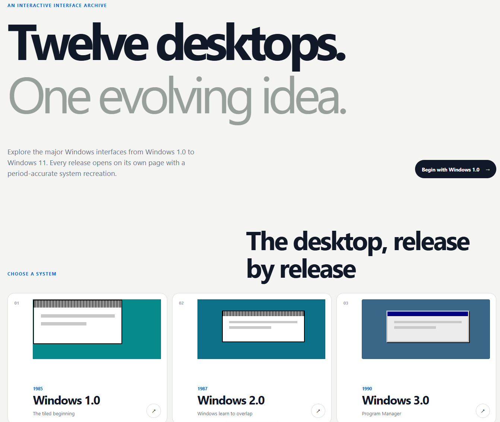
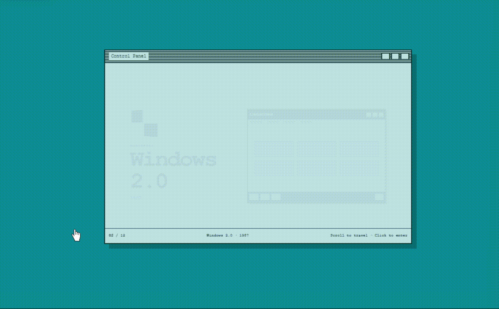

# Breakthrough: turning the thesis into a rendered-height gate

Before this breakthrough, I directed the agent component by component. A quiz,
games, easter eggs, historical notes, and desktop recreations each looked
relevant when reviewed alone. The prototype was interactive, but the interaction
was drifting into a Windows museum. Measuring the Windows XP page at the phone
width exposed the problem: only **28%** of its substantive rendered height
actually explained the claim that redesign makes people relearn familiar
actions.

The specific change was a harness rule, not a request for “more content.” I
added an acceptance gate to `CLAUDE.md` and Playwright: at 390×844, the test
finds the ten substantive sections in every release, measures their real browser
heights, requires each to contain substantial version-specific relearning
evidence, and rejects any chapter below 90%. I deleted four completed mechanics,
then reframed the desktop, Start challenge, adoption data, history, applications,
reviews, system notes, story, and contributors around one learned habit. All
twelve chapters now measure 100%.

That gate worked because it changed what the agent had to satisfy. “Make it more
educational” invites another section; a rendered ratio makes dilution fail. It
also guided later decisions: the homepage stayed an index, the releases became
one top-to-bottom explainer, W/S moves between chapters, and sound waits for a
deliberate click. Browser checks now cover the interaction, resize, layout,
contrast, and competing audio players.

This changed the developer I want to be. I no longer equate more mechanics with
more engagement. I want to state the lesson, measure whether the visitor
encounters it, delete attractive work that weakens it, and preserve every
important correction as a constraint the next version must pass.
