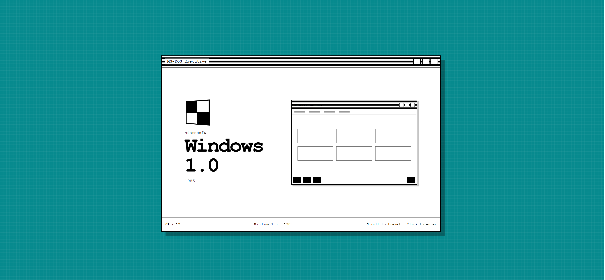

# Insight: the interaction has to perform the explanation

My breakthrough was realising that a collection of interactive pages was not
yet an interactive explainer. Before commit `9aa6e9b` I had asked the agent for
a Windows archive, and it built exactly that: a polished editorial homepage
with twelve release cards, each linking to a themed recreation. The visitor's
role was still passive — scroll a catalogue, pick a version, read about it. The
page *said* Windows kept changing. Its interaction did not.

## Before

So I stopped directing through visual requests and changed the interaction
contract instead. I specified one mechanic: scrolling or pressing an arrow must
move through Windows history one release at a time. Then I encoded it in
`timeline-entry.test.ts` — one central window, forward and backward navigation,
an updating version label, and a link that always opens the release on screen.
The test also rejected the old `.release-grid` outright, so the design I had
discarded could not quietly return.

## After `9aa6e9b`

The agent replaced the card page with a single full-screen Windows window that
changes era as you move through it. It worked because the visitor's action now
maps onto the idea: moving through the interface *is* moving through time.

This changed my idea of what a useful interaction is. I had been counting them
— a quiz, playable games, two easter eggs — as if more things to click meant
more explaining. They did not. An interaction earns its place only when doing
it teaches the thing the page is about, which is why I deleted four finished,
passing features and kept the one that asks you to find where Start moved. I
want to be the developer who asks what an interaction teaches before asking
whether it works.
